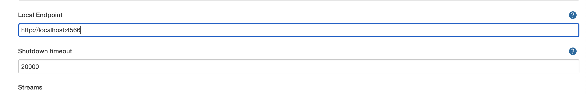

AWS Kinesis Consumer Plugin for Jenkins
=======================================================

[](https://plugins.jenkins.io/aws-kinesis-consumer)
[](https://plugins.jenkins.io/aws-kinesis-consumer)
[](https://ci.jenkins.io/job/Plugins/job/aws-kinesis-consumer-plugin/job/master/)

aws-kinesis-consumer is a Jenkins plugin to connect to [Kinesis](https://aws.amazon.com/kinesis/) and consume
records coming from specific streams.

This plugin has global configuration only, so any features for user are not provided.

Configuration
---

The plugin adds a "AWS Kinesis Consumer" section in the Global Configuration
page:


These are the configurable parameters:

**Main section**

* `Enable consumer`: when enabled the consumer will try to connect to all
the configured streams
* `Region`: AWS Region hosting the Kinesis stream. This parameter is
optional. If set it will override any Region set in the Region Provider Chain.
* `ApplicationName`: prefix added to the consumer name to make sure consumer
names are unique as requested by Kinesis

`Advanced Options` are available to use AWS Kinesis instances running on
[Localstack](https://github.com/localstack/localstack):



* `Local Endpoint`: HTTP endpoint for the local AWS Kinesis stack
* `Shutdown timeout`: maximum total time (milliseconds) waiting when
shutting down Kinesis consumers. Default is 20 seconds.

**Streams section**

Mutltiple AWS Kinesis streams can be configured to listen from
* `Stream name`: name of the Stream to consume events from
* `Initial position in stream`: position to start consuming from
(accepted values: *TRIM_HORIZON* or *LATEST*)
* `Trigger SCM Build`: If set, a build of SCM sources will be triggered upon
receiving a message. If the event received contains a project update, a
build will be triggered for SCM sources pointing to the project.
* `Project Name JSON Path query`: [JSON Path](https://support.smartbear.com/alertsite/docs/monitors/api/endpoint/jsonpath.html)
query to extract the project name from the event

Implement listener plugin
------------------------

This plugin provides an interface to listen application records coming from
Kinesis.

To implement listener in your plugin, the below dependencies need to be added in
your pom.xml:

```xml
<project>

  <dependencies>
    <dependency>
      <groupId>io.jenkins.plugins</groupId>
      <artifactId>aws-kinesis-consumer</artifactId>
      <version>VERSION</version>
    </dependency>
  </dependencies>

</project>
```

Following is the Extension Point that will have to be implemented:

> io.jenkins.plugins.aws.kinesisconsumer.extensions.AWSKinesisStreamListener

Prepare a release
---

1. Update the `README` with the release notes. Use the following oneliner to
capture the changes since the last release:

```bash
> git log --pretty=oneline --abbrev-commit --no-merges
aws-kinesis-consumer-<latest_versions>..HEAD
```

2. Commit the `README` with the following message: `"Prepare v<new_version>
release notes"`. For example:

```bash
> git show  --pretty=format:"%s" -s  94398d33c4ca7f2010b01c8f6173a8c3cf79e0bf
Prepare v1.0.4 release notes
```
3. Perform the release (_NOTE: only the plugin maintainers have permissions to
publish the artifacts_):

```bash
> mvn release:clean release:prepare release:perform
```

The artifact will be available in the [Jenkins Maven repository](https://repo.jenkins-ci.org/artifactory/releases/io/jenkins/plugins/aws-kinesis-consumer/)

Plugin Releases
---

### v1.0.5 - Released - 17 September 2021

* `87f58c6` Bump up Jenkins version to 2.312

### v1.0.4 - Released - 15 September 2021

* `0fab7b6` Move stream filtering to client
* `6b3c9d1` Upgrade com.google.guava:guava
* `b29949b` Upgrade org.apache.commons:commons-compress

### v1.0.3 - Released - 14 September 2021

* `0e6bc81` Make consistent use of logger library
* `58ca196` Handle kinesis record processor phases
* `be03616` Restart consumers upon configuration change
* `67062a2` Introduce shutdownTimeoutMs configuration
* `ebc1f0c` Automatically start consumers when jenkins is ready
* `95deed1` Connect to multiple kinesis streams
* `c0867be` Consolidate AWS async client builder
* `088f0d6` Handle KinesisConsumer shutdown
* `abbd4f7` Make applicationName configurable

### v1.0.2 - Released - 13 September 2021

Initial version of the plugin to connect and consume records from AWS Kinesis

Issues
---
